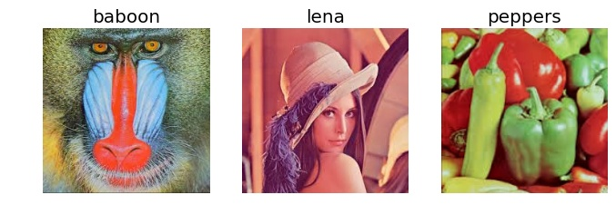
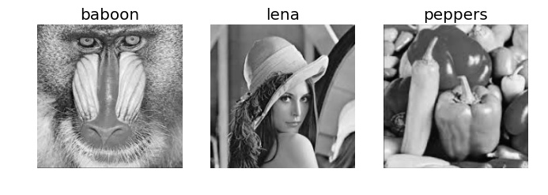
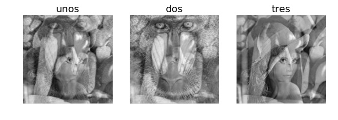
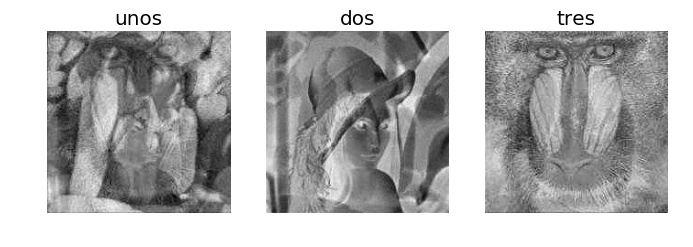
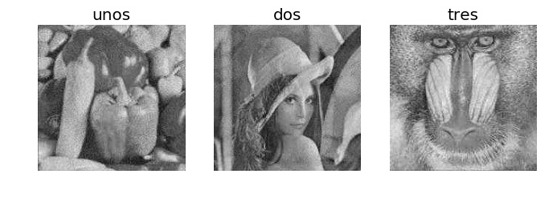
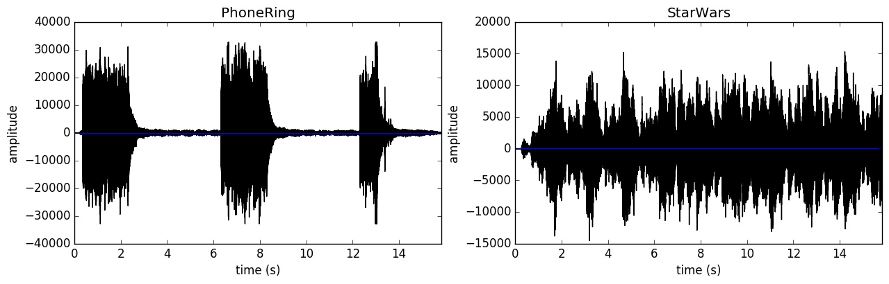
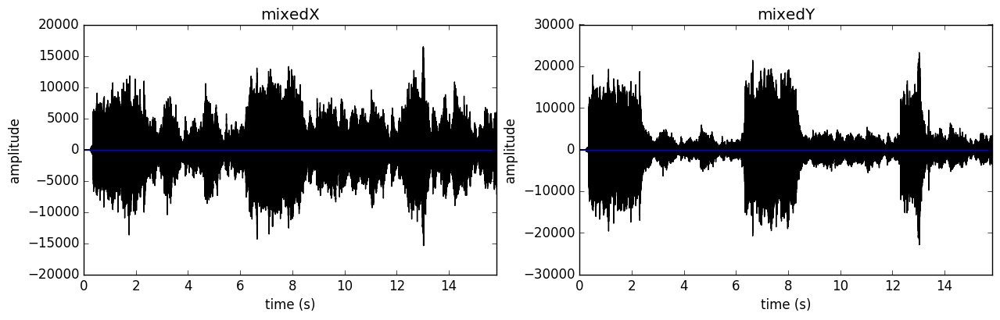
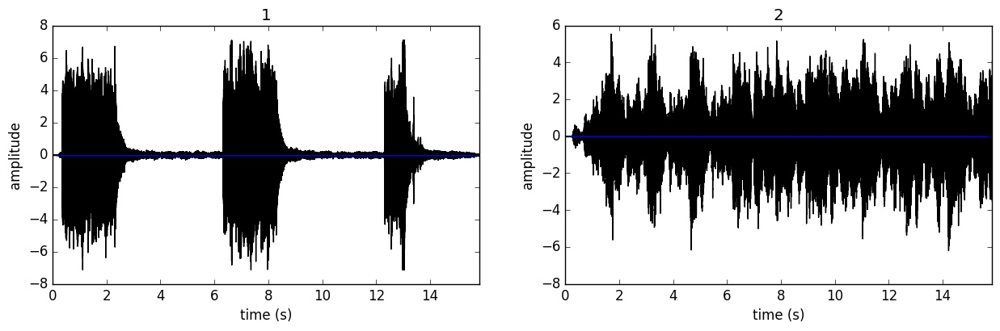

# Cocktail Party Problem

Cocktail Party Problem or the Blind Source Separation is a classical problem.  
The motivation for this problem is, imagine yourself in a party with a lot of people.  
There will be a sort of cacaphony becasue of all the people taling at the same time.  
Now you can shut out the voices in the background to hear some specific conversation.  
We also want to do the same and let's formalize what we are trying to do.  
Let's say there are m sources which are producing signal according to some distribution
independent of each other and we have n microphones which record the signals arriving at them.  
We try to decipher the underlying source signals from the mixed signals arriving at the microphones.  
We will try and constraint the problem a little more so that we can move forward.  
The first assumption is that the mixed signals are a **linear combination** of the source signals.  
The second assumption is that the **number of source and number of microphones are equal.**  

## Using ICA to solve the problem for images as well as sound signals

The same algorithm will be tried on images, to try and separate the mixed images and get the original images back.  
To try the code:  
- fork the repository and place the mixed images in `images/mixed/` folder or for sound signals `sounds/` folder. 
- Run the `preprocess_sound.py` in `sounds/` to get the same sampling rate for each sound signal.(You may have to change the filenames in the code)
- Run `image_FastICA_FOBI.py` or `image_FastICA_FOBI.py`. 
- And that's it you are done! The output will be in the same directory for the sounds and `images/after/` folder for images.
 
### FastICA and FOBI applied to images

The FastICA algorithm uses a fixed-point iteration scheme to try and find the independent componenets.
It is very sensitive to the functions used for approximating the negentropy.
The math behind the algorithm takes some time to understand but intuitively they are trying to find the vectors which 
maximizes the non-gaussanity of the signals.  
To understand the algorithm fully I would encourage you to dive straight into the paper itself  
[Independent Component Analysis:Algorithms and Applications](http://www.sciencedirect.com/science/article/pii/S0893608000000265) - *A. Hyvärinen and E. Oja*

FOBI is a one shot algorithm which tries to solve the same problem with matrix factorization and finding the eigenvectors  
of a quadratically weighted covariance matrix of the data. The eigenvectors form the mixing matrix and is orthogonal  
which is to be expected.  
The proof and math behind the algorithm is neatly explained in the original paper  
[SOURCE SEPARATION USING HIGHER ORDER MOMENTS](http://ieeexplore.ieee.org/document/266878/) - *Jean-Francois Cardoso*

The original colored images

The black and white images which were used

The images after they were mixed linearly

The results of running the FOBI algorithm

The result of running the FastICA algorithm

### FastICA and FOBI applied to sounds

The above 2 algorithms work straight out of the box for sounds as well.

The original sounds

The mixed sounds

Seperated sounds using FOBI

Seperated sounds using FastICA

To listen to the separated sounds, head over to `sounds/` folder.  
The sounds are labelled so that there is no confusion.

Enjoy!
